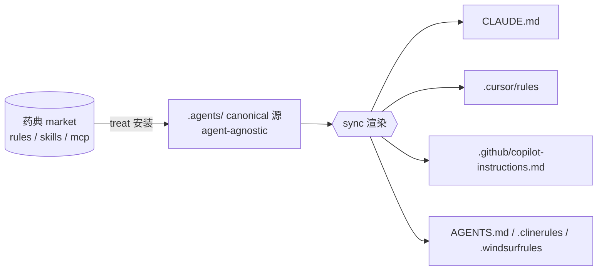

# zai-doctor

agent-agnostic 的个人 coding-agent 工程化工具。像医生一样：**建档 -> 诊断 -> 开方 -> 下药 -> 复诊**，对症下药。

面向主流 coding agent，不绑死某一家。前端优先。

> 当前为 **Phase 5/6**：建档/诊断/开方/下药/换药/覆盖/查药典已可用；catalog 静态站已建；多 agent 扩展仍在规划。

## 它解决什么

- **统一来源**：项目里用 `.agents/` 存 agent-agnostic 的 canonical 资产（rules/skills/mcp）
- **同步转化**：一条命令把 `.agents/` 渲染成各 agent 原生配置（软链优先，降级 copy，受管文件冲突保护）
- **诊断**：检查项目 agent 配置工程化是否到位，出症状报告

核心机制：一份 canonical 源，`sync` 一次，多 agent 原生配置就位。



详细架构与流程图见 [docs/guides/ARCHITECTURE.md](docs/guides/ARCHITECTURE.md)。

## 快速开始

```bash
# 接入
git clone https://github.com/ziangtin/zt-ai-doctor.git && cd zt-ai-doctor && pnpm install

# 看诊流程（dev 模式）
pnpm --filter zai-doctor dev -- init          # 建档
pnpm --filter zai-doctor dev -- diagnose      # 诊断
pnpm --filter zai-doctor dev -- prescribe     # 开方（编辑 .agents/.build/prescription.md 勾选）
pnpm --filter zai-doctor dev -- treat         # 下药（按处方单抓药 + sync）
```

完整接入与使用文档见 [docs/guides/USAGE.md](docs/guides/USAGE.md)。

## 命令

| 命令 | 状态 | 作用 |
|---|---|---|
| `init` | ✅ | 建档：建 `.agents/` + lockfile |
| `list` | ✅ | 查药典：列资产 + 已装状态（`--type`/`--tag` 筛选） |
| `info <id>` | ✅ | 查资产详情 + 已装状态 + hash 一致性 |
| `diagnose` | ✅ | 诊断：agent 配置/资产健康/药典新鲜度/环境，出症状报告（`--strict` 阻塞返回非零） |
| `treat [ids...]` | ✅ | 下药：装资产 + sync 渲染 + placement 报告（不带 id 按处方单抓药） |
| `override <id>` | ✅ | 覆盖：拷资产到 `.agents/company/` 作 company 覆盖起点 |
| `remove <id>` | ✅ | 移除：删已装资产 + sync 清理 agent 配置（company overlay 不动） |
| `sync` | ✅ | 换药：渲染 `.agents/` 到 agent 配置（`--copy` 强制 copy） |
| `update` | ✅ | 药典更新：刷新版本 + integrity；`--source <git-url>` 从 git 拉取 |
| `trust <id>` | ✅ | 信任 MCP：展示 command/args + 未固定版本警告（未信任则 sync 不写 MCP 配置） |
| `prescribe` | ✅ | 开方：技术栈匹配 + 处方单（`--tag` 筛选）；`treat` 不带 id 按处方单抓药 |

建议 `alias zd=zai-doctor`。

## Agent 支持

- **已实现**：Claude Code、Cursor、Copilot、Codex、Cline、Windsurf
- 类型覆盖矩阵见 [docs/guides/COVERAGE_MATRIX.md](docs/guides/COVERAGE_MATRIX.md)

## 仓库结构

```
zt-ai-doctor/
├── cli/        # zai-doctor CLI（Node + TS）+ market/（canonical 资产，随包发布）
├── catalog/    # 静态站（Astro，扫 cli/market 生成）
└── docs/       # guides（使用）/ design（设计演进）/ changelog（版本日志）
```

## 开发

```bash
pnpm install
pnpm dev <command>        # 例：pnpm dev diagnose
pnpm lint
pnpm build
```

## Catalog 静态站

药典资产的可浏览静态站（Astro），扫 `market/` 生成。

```bash
pnpm --filter catalog dev      # 本地预览
pnpm --filter catalog build    # 生成 catalog/dist
```

线上：<https://ziangtin.github.io/zt-ai-doctor/>（push main 自动部署，需 repo settings: Pages source = GitHub Actions）

设计见 [docs/design/IMPLEMENTATION_PLAN.md](docs/design/IMPLEMENTATION_PLAN.md)，当前方案评审见 [docs/design/CURRENT_SOLUTION_REVIEW.md](docs/design/CURRENT_SOLUTION_REVIEW.md)。
架构与流程图见 [docs/guides/ARCHITECTURE.md](docs/guides/ARCHITECTURE.md)。
