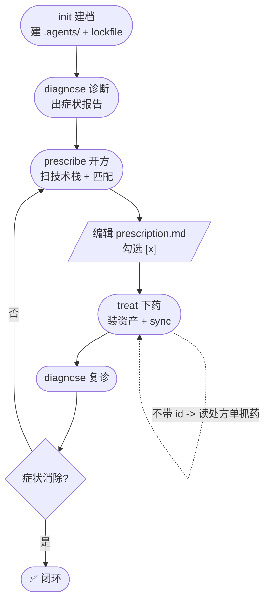
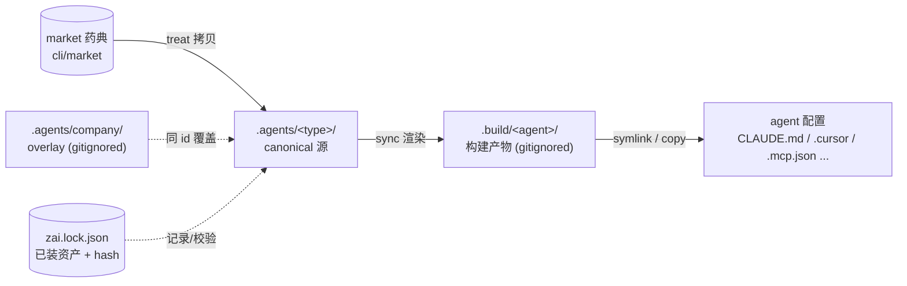
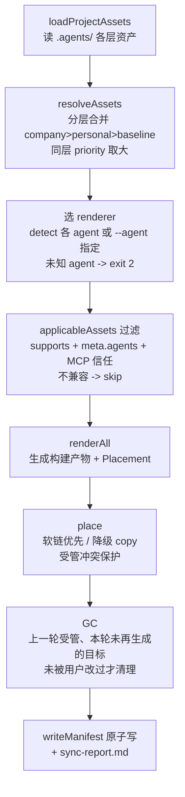
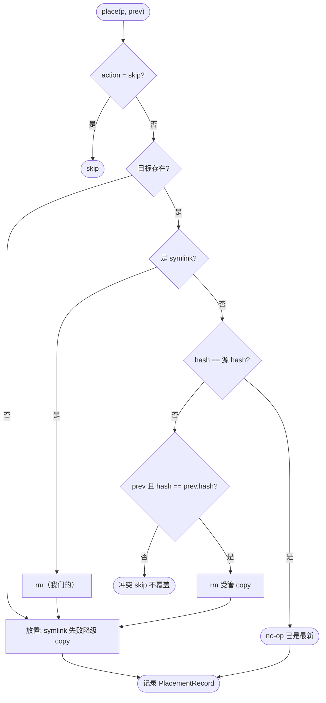
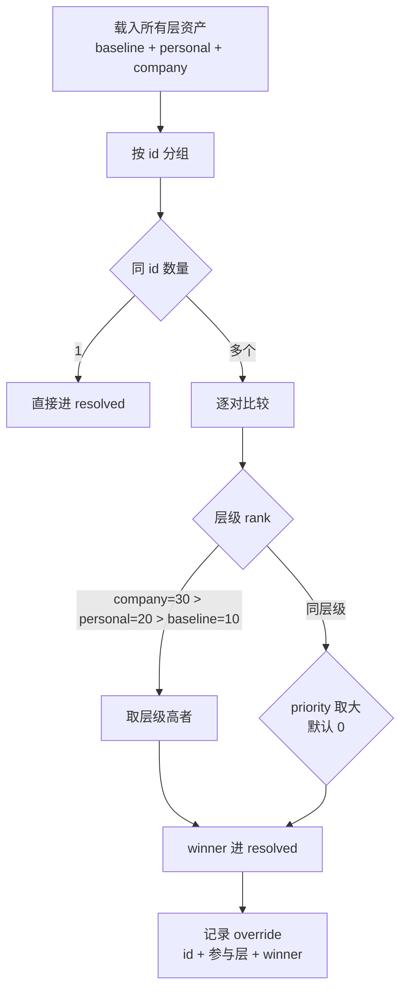
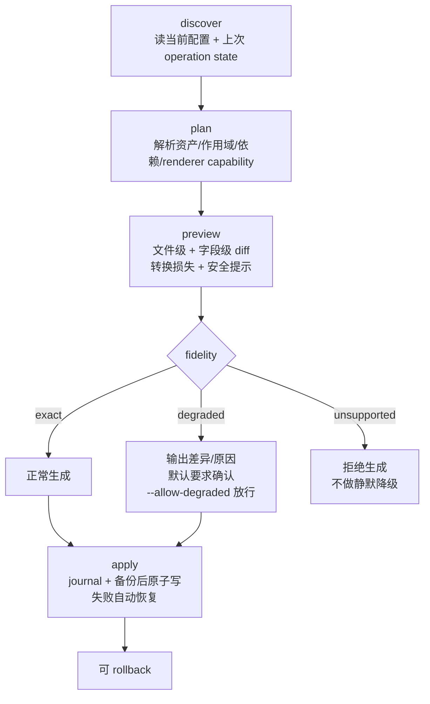

# zt-ai-doctor 架构与流程

> 本文档用流程图说明 zt-ai-doctor 的设计流程、数据流与实现链路。所有图使用 Mermaid，GitHub 原生渲染。
>
> - 图 1–2：**设计视角**（用户流程、数据流）
> - 图 3–5：**实现视角**（对应源码，反映当前真实行为）
> - 图 6：**规划中**的未来架构（来自 [PRODUCT_OPTIMIZATION_PLAN.md](../design/PRODUCT_OPTIMIZATION_PLAN.md)，尚未实现）

## 图例

| 形状 | 语法 | 含义 |
|---|---|---|
| 矩形 | `[text]` | 处理 / 步骤 |
| 胶囊 | `([text])` | 起止 / 状态 |
| 菱形 | `{text}` | 判断 |
| 圆柱 | `[(text)]` | 数据存储 |
| 平行四边形 | `[/text/]` | 输入 / 输出 |
| 虚线 | `-.->` | 记录 / 校验等弱依赖 |

---

## 1. 看诊流程（设计 · 用户视角）

整个工具按医生看诊走：**建档 -> 诊断 -> 开方 -> 下药 -> 复诊**，对症下药。`prescribe` 内部先跑诊断，`treat` 不带 id 时读处方单勾选抓药，复诊未消除症状则回到开方。

---

## 2. 数据流（设计 · 数据视角）

药典（`market`）经 `treat` 拷贝成项目内 canonical 源（`.agents/<type>/`），再经 `sync` 渲染成构建产物（`.build/<agent>/`），最后以 symlink/copy 落到各 agent 原生配置。company overlay 按 id 覆盖 canonical，lockfile 记录并校验已装资产。

---

## 3. sync 引擎实现流程（实现 · 核心）

对应 [sync.ts](../cli/src/commands/sync.ts) 的 `runSync`：读资产 -> 分层合并 -> 选 renderer -> 兼容/信任过滤 -> 渲染 -> 放置 -> GC -> 写 manifest 与报告。

---

## 4. place 放置决策（实现 · 细节）

对应 [place.ts](../cli/src/core/place.ts) 的 `place()`。这是 Windows copy 降级后仍可重同步、以及保护用户修改的关键决策树：受管 symlink 直接替换；内容一致 no-op；受管 copy 源更新可覆盖；用户改过或未知文件则冲突 skip，绝不自动覆盖。

---

## 5. 分层合并决策（实现 · 细节）

对应 [layers.ts](../cli/src/core/layers.ts) 的 `resolveAssets`。同 id 资产按层 `company(30) > personal(20) > baseline(10)` 取高；同层按 `priority`（默认 0）取大；多于一个则记录 override，落进 sync 报告。

---

## 6. 未来 sync 四阶段（规划中）

> ⚠️ 尚未实现，来自 [PRODUCT_OPTIMIZATION_PLAN.md](../design/PRODUCT_OPTIMIZATION_PLAN.md) §5.3 / §2.2。

规划中的 sync 收敛为 `discover -> plan -> preview -> apply` 四阶段，并引入转换 fidelity 三级：`exact` 正常生成、`degraded` 有损需确认、`unsupported` 拒绝生成不静默降级；写操作走 journal + 备份，可 rollback。

---

设计见 [../design/IMPLEMENTATION_PLAN.md](../design/IMPLEMENTATION_PLAN.md)，使用说明见 [USAGE.md](./USAGE.md)，当前方案评审见 [../design/CURRENT_SOLUTION_REVIEW.md](../design/CURRENT_SOLUTION_REVIEW.md)。
